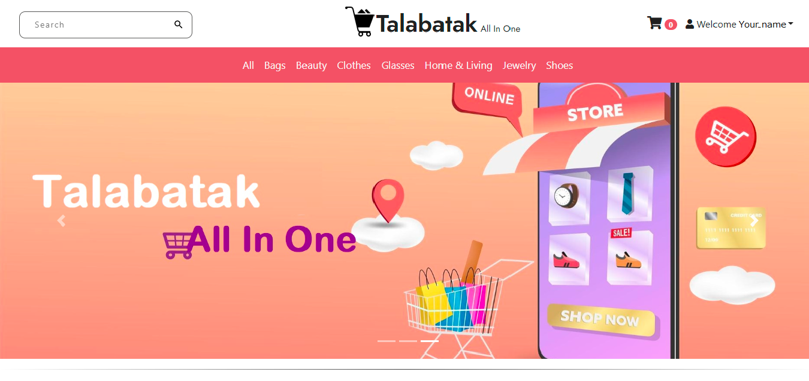

# Talabatak

## Table of contents

- [Introduction](#introduction)
- [Demo](#demo)
- [Technology](#technology)
- [Features](#features)
- [Database Models](#database)

## Introduction

A virtual ecommerce website using Node js, Express js, and Mongoose.

## Demo

The website resembles a real store and you can add products to your cart and pay for them. If you want to try the checkout process, you can use the dummy card number provided by stripe for testing which is 4242 4242 4242 4242 with any expiration date, CVC, and zip codes. Please <u><b>DO NOT</b></u> provide real card number and data.

In order to access the admin panel on "/admin" you need to provide the admin email and password.

## Features

The application displays a virtual bags store that contains virtual products and contact information.

Users can do the following:

- Create an account, login or logout
- Browse available products added by the admin
- Add products to the shopping cart
- Delete products from the shopping cart
- Display the shopping cart
- To checkout, a user must be logged in
- Checkout information is processed using stripe and the payment is send to the admin
- The profile contains all the orders a user has made

Admins can do the following:

- Login or logout to the admin panel
- View all the information stored in the database. They can view/add/edit/delete orders, users, products and categories. The cart model cannot be modified by an admin because a cart is either modified by the logged in user before the purchase or deleted after the purchase.

## Database

All the models can be found in the models directory created using mongoose.

### User Schema:

- username (String)
- email (String)
- password (String)

### Category Schema:

- title (String)
- slug (String)

### Product Schema:

- productCode (String)
- title (String)
- imagePath (String)
- description (String)
- price (Number)
- category (ObjectId - a reference to the category schema)
- manufacturer (String)
- available (Boolean)
- createdAt (Date)

- 2022 Made By [Farha Dahman, Nama' Salameh, Raghad Khatatba, Ahmad Amer]
